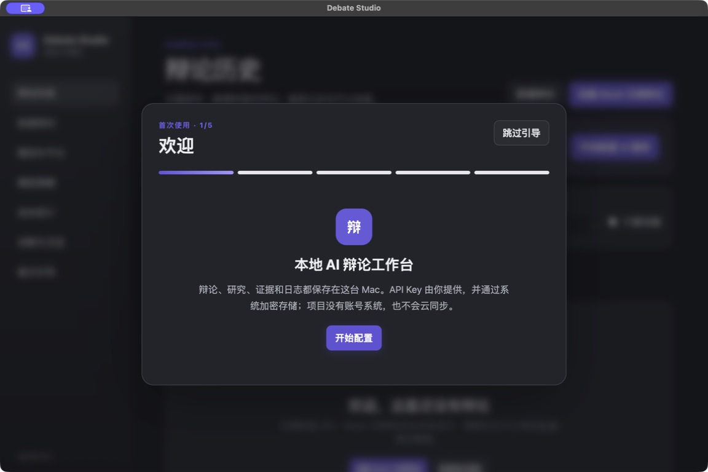

# Debate Studio

Debate Studio 是一个本地运行的 macOS AI 辩论工作台。它把模型连接、研究、证据、流式辩论、历史、诊断和导出放在同一个 Electron 应用中，适合个人长期使用。

项目不提供云同步、账号系统或商业化后台。你的数据库、研究资产、日志与加密凭据都留在本机。



> 截图维护位置：`docs/screenshots/`。发布前请使用 Mock 数据更新图片，避免包含私人辩题、真实 Key 或本机路径。

## 当前能力

- 显式辩论状态机、暂停/继续/停止/失败重试与重启恢复
- Mock 与 OpenAI Chat Completions Compatible 流式模型连接
- Tavily 搜索、自主研究、私有研究隔离与公开证据桌
- SQLite 历史、备份恢复、Markdown/HTML 导出、错误中心和结构化日志
- 首次启动引导、按任务模型路由、基于真实 Usage 的成本估算
- 图片缩略图与 PDF 元数据；Mock Vision 分析边界（真实 Vision 协议尚未接入）

## 安装

1. 从 GitHub Releases 下载 `Debate-Studio-*-arm64.dmg`。
2. 打开 DMG，将 **Debate Studio** 拖入“应用程序”。
3. 当前公开构建可能未签名。首次打开若被 macOS 阻止，请在“系统设置 → 隐私与安全性”中选择“仍要打开”，再确认一次。

仅在你理解 Gatekeeper 提示且确认 DMG 来源可信时，也可以移除该应用的隔离属性：

```bash
xattr -dr com.apple.quarantine "/Applications/Debate Studio.app"
```

当前构建面向 Apple Silicon（arm64）。发布签名与公证需要维护者自己的 Apple Developer 证书。

## 首次使用

首次启动会显示五步引导：选择服务商、保存 API Key、测试连接、生成默认模型策略、创建离线 Mock 示例。你可以跳过引导；Mock 功能始终可用，首页会保留“开始配置 AI 服务”的提示。

API Key 只会从 Renderer 作为一次性 IPC 输入传入主进程，随后由 Electron `safeStorage` 加密并写入应用数据目录中的独立凭据库。SQLite、日志、导出和 IPC 返回值不包含 Key 或 `credentialRef`。

更多配置见 [Provider Setup](docs/PROVIDER_SETUP.md)。

## 开发环境

- macOS（打包与窗口验收）
- Node.js 22+
- npm

```bash
npm ci
npm run dev
```

质量检查：

```bash
npm run typecheck
npm test
npm run build
```

本地 arm64 DMG：

```bash
npm run release:mac:arm64
npm run release:check
```

自动测试只使用 MockAdapter、MockHttpTransport 和 MemoryCredentialStore，不访问真实网络或真实系统凭据。

## 架构

```text
React Renderer
  → 白名单 preload API
  → Zod 校验 IPC
  → 应用服务
  → DebateEngine / Runtime / RoutingPolicy
  → Adapter / Repository / CredentialStore / AssetProcessor
  → SQLite、safeStorage、本地文件、用户配置的模型服务
```

Renderer 没有 Node、SQLite、文件系统或凭据权限；`contextIsolation: true`，`nodeIntegration: false`。详见 [Architecture](docs/ARCHITECTURE.md) 与 [Security](docs/SECURITY.md)。

## 数据隐私

- 默认数据目录：`~/Library/Application Support/debate-studio/`
- 删除应用不会自动删除数据目录。
- 备份包含 SQLite 业务数据，不包含加密凭据库。
- 导出默认不包含私有研究；选择包含时会明确提示。
- 诊断报告不包含辩论正文、完整网页正文、私有研究或凭据。

目录与备份说明见 [Data Storage](docs/DATA_STORAGE.md)。

## 开源与贡献

项目采用 [MIT License](LICENSE)。提交 Issue 或 Pull Request 前，请确认补丁、截图、测试夹具和日志中不包含真实 API Key、用户资料、数据库或绝对个人路径。
