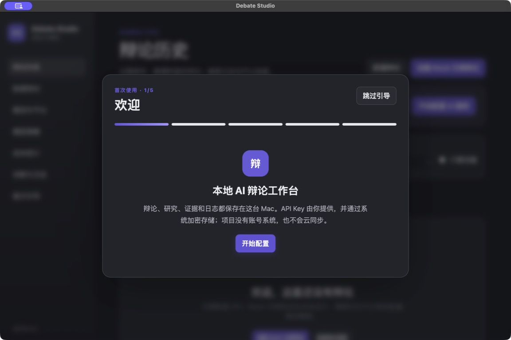

# Debate Studio

**一个面向 macOS 的本地 AI 辩论、研究与证据工作台。**

[](https://github.com/AS13379/debate-studio/releases/latest)
[](https://github.com/AS13379/debate-studio/releases/latest)
[](LICENSE)

Debate Studio 把模型配置、辩题规划、资料研究、证据管理、流式辩论、裁判评分、赛后复盘、历史归档和导出放进一个桌面应用。它适合希望长期保存讨论过程、比较不同模型与 Prompt、又不想把个人资料交给云端平台的用户。



## 丰富但不杂乱

- **AI 辩题规划**：只输入辩题即可生成背景、双方立场、核心争议、研究方向和证据建议，也支持辅助完善与完全手动。
- **多模型协作**：为主持人、正方、反方和裁判分别选择模型，并按规划、研究、反驳、裁判、视觉分析等任务设置模型策略。
- **自主研究与证据**：接入 Tavily 或 Mock 搜索，读取网页、保存笔记与暂定主张；双方私有研究严格隔离，公开证据使用稳定编号并保留状态历史。
- **可观察的辩论过程**：流式展示发言与模型思考活动，支持暂停、继续、停止、跳过阶段和失败重试，意外退出后可以恢复。
- **结构化裁判与复盘**：从逻辑、证据、反驳、事实、深度和表达六个维度评分，生成胜负、转折点、亮点、不足与改进建议。
- **长期资料库**：SQLite 本地保存历史，可重命名、收藏、标签、归档、软删除和恢复；支持 Markdown/HTML 导出与数据库备份。
- **Prompt Studio 与质量分析**：管理 Prompt 版本、回滚和对比，并查看不同版本的评分表现。
- **局域网 Web 控制台**：在可信家庭网络中，用手机或平板查看历史、创建辩论、控制运行、上传资料和下载导出。
- **本地诊断与成本统计**：结构化日志自动脱敏；仅按服务商真实返回的 Token 统计，不伪造未知用量。

## 优良设计

- **本地优先**：SQLite、研究资料、日志和导出都保存在本机，不提供账号系统、云同步或遥测。
- **凭据隔离**：API Key 由主进程安全保存，不进入 SQLite、Renderer、日志、导出或 IPC 返回值。
- **清晰边界**：Electron 使用 `contextIsolation: true`、`nodeIntegration: false`；Renderer 只能调用经过 Zod 校验的白名单接口。
- **可替换架构**：DebateEngine、Runner、ModelAdapter、SearchTool、Repository 和 CredentialStore 相互解耦，Mock 与真实服务共用同一条运行链路。
- **可恢复运行**：Turn、事件、研究结果和错误会增量持久化；重试创建新记录，不覆盖失败现场。
- **安全更新**：macOS 客户端使用 Sparkle 2 与项目 EdDSA 发布签名验证更新包，应用升级不会覆盖本地用户数据。

## 快速开始

1. 从 [GitHub Releases](https://github.com/AS13379/debate-studio/releases/latest) 下载 Apple Silicon DMG。
2. 将 **Debate Studio** 拖入“应用程序”并打开。
3. 按首次引导配置模型，或跳过配置直接创建离线 Mock 示例辩论。
4. 在“新建辩论”中输入辩题，生成方案并开始运行。

当前社区构建未经过 Apple Developer ID 公证。首次打开若被 macOS 阻止，请确认安装包来自本仓库，再前往“系统设置 → 隐私与安全性”允许打开。

详细教程见 **[Debate Studio Wiki](https://github.com/AS13379/debate-studio/wiki)**。

## 支持的平台与接口

应用支持标准 OpenAI Chat Completions Compatible 接口，并内置 OpenAI、DeepSeek、Moonshot / Kimi、智谱、阿里云百炼、Gemini OpenAI Compatible 和小米 MiMo 等平台预设。模型 ID、能力和价格可能随服务商调整，请以相应平台官方说明为准。

真实模型和搜索服务会消耗你在对应平台的额度；Debate Studio 本身不代售额度，也不会上传你的 Key。

## 数据与隐私

默认数据目录为：

```text
~/Library/Application Support/debate-studio/
```

- 删除或升级应用不会自动删除该目录。
- 导出默认不包含双方私有研究，只有用户明确勾选后才会加入。
- 诊断报告不包含 API Key、凭据引用、完整辩论正文、完整网页正文或私有研究。
- 局域网访问默认关闭，只建议在个人可信网络中主动开启。

更多说明见 [安全设计](docs/SECURITY.md)、[数据存储](docs/DATA_STORAGE.md) 和 [架构文档](docs/ARCHITECTURE.md)。

## 本地开发

需要 macOS、Node.js 22+ 和 npm：

```bash
npm ci
npm run dev
```

检查项目：

```bash
npm test
npm run typecheck
npm run build
```

自动测试使用 MockAdapter、MockHttpTransport 和 MemoryCredentialStore，不访问真实 API 或真实系统凭据。

## 开源

项目采用 [MIT License](LICENSE)。提交 Issue、截图或日志前，请先移除真实 API Key、数据库、个人辩题、研究资料和本机绝对路径。

## Star History

<a href="https://www.star-history.com/?repos=AS13379%2Fdebate-studio&type=date&legend=top-left">
 <picture>
   <source media="(prefers-color-scheme: dark)" srcset="https://api.star-history.com/chart?repos=AS13379/debate-studio&type=date&theme=dark&legend=top-left&sealed_token=6eVgpc0CpOqV_rlwh2UHFrFIwVocUrM60wvXcLR0V15BIlR9iwTsHrdSOSDiDaHG2aoQ_oqJMXnmLSh3VRDAzamRdDx45fAb5xvbgcZLoLynqokm7O5re5aD1n1VgUW4OYLyD0XFgvJkMezvpFqSVqXMOED2Z9LIFgi-i81lGSB8tkG6nbCGUjjOImUa" />
   <source media="(prefers-color-scheme: light)" srcset="https://api.star-history.com/chart?repos=AS13379/debate-studio&type=date&legend=top-left&sealed_token=6eVgpc0CpOqV_rlwh2UHFrFIwVocUrM60wvXcLR0V15BIlR9iwTsHrdSOSDiDaHG2aoQ_oqJMXnmLSh3VRDAzamRdDx45fAb5xvbgcZLoLynqokm7O5re5aD1n1VgUW4OYLyD0XFgvJkMezvpFqSVqXMOED2Z9LIFgi-i81lGSB8tkG6nbCGUjjOImUa" />
   
 </picture>
</a>
